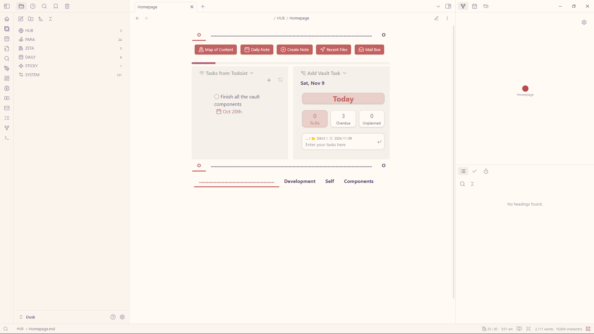
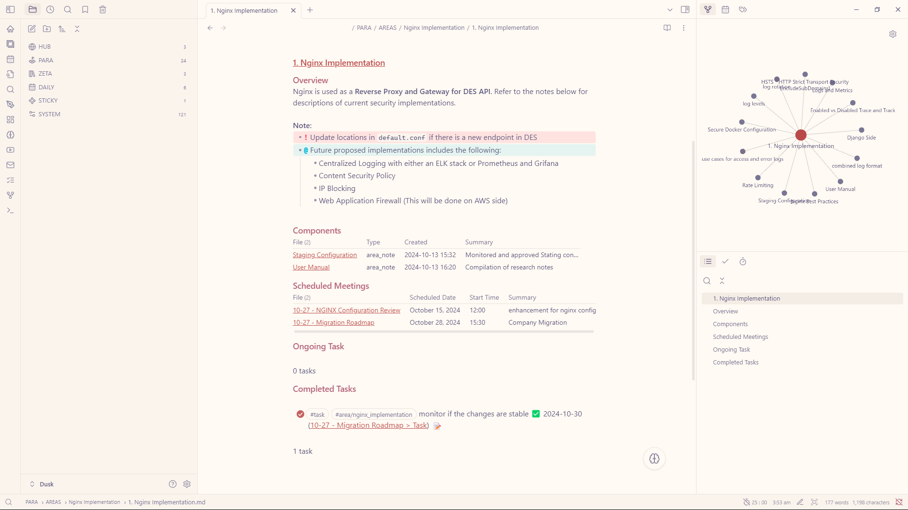
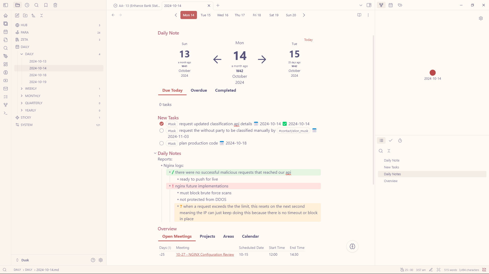
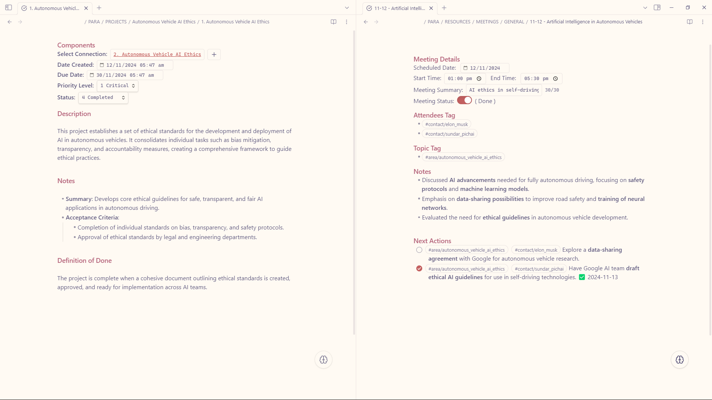
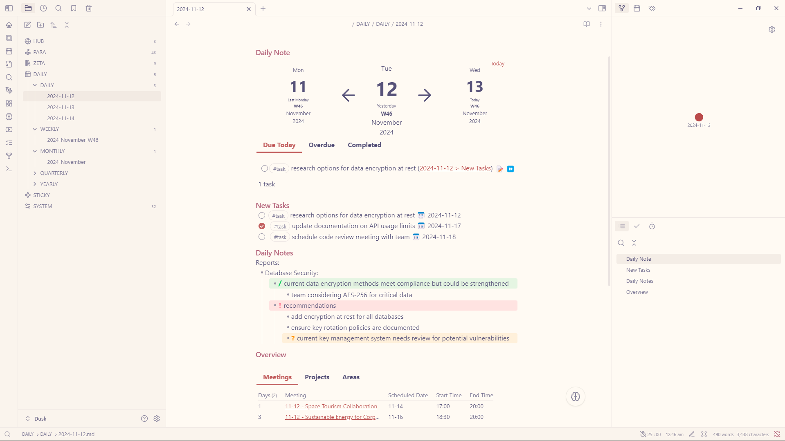

## Highlight
I am working on a vault update to enhance performance and improve workflows. Looking to have it up before January 25, 2025.

## Recent Updates (November 16, 2024):
- [x] hotfix for area templates (area_family, area_note, area_note_sub)
- [x] hotfix for monthly note template
- [x] final version of documentation for vault concept map

Note: If you have an older zip file (the version with light integration) and you already have your files migrated, simply copy the files from the update folder and paste them into their respective locations. However, please note that your documentation will remain outdated.

## Vault Structure
This vault fuses **PARA** and **Zettelkasten** frameworks for a dynamic, scalable knowledge system.
- **HUB**: Central command with a homepage, map, and inbox for seamless navigation and task tracking.
- **PARA**: Action-focused—**Projects** for deadlines, **Areas** for ongoing pursuits, **Resources** for all reference materials, and **Archive** for completed work.
- **ZETA**: Idea-centric—**Permanent Notes** for lasting insights, **Literature** for research, and **Fleeting Notes** for quick ideas.
- **DAILY**: Organized reflections on a daily, weekly, or monthly basis.
- **STICKY**: Temporary notes for brainstorming.
- **SYSTEM**: Core vault setup, housing media, templates, and configurations.

Built for growth, this structure adapts as your knowledge and projects evolve!
## Vault Features
- [x] **Mobile Friendly** - Compatible with mobile display
- [x] **Homepage** - Enhanced homepage that allows quick navigation across the vault.
- [x] **Map of Content** - Easily search notes with the help of Datacore.
- [x] **Mail Box** - View completed and existing "Page Task" with the help of Datacore.
- [x] **Page Task** - Mark note files as a task (this is different from the task inside a note).
- [x] **Floating Action Button** -  A FAB to assist you so you can focus more on taking down notes.
- [x] **Connections and Quick Navigation** - Access anything anywhere.
- [x] **Focus Mode** - Focus mode macro command and pomodoro integration
- [x] **QuickAdd** - Templates and Macro commands available
- [x] **Hotkeys** - Convenient hotkey binding for common functionality.
## Additional Notes
- Highly detailed vault documentation can be found inside the vault.
- two `.zip` files are available for each vault type (`Dusk` and `Dusk_light`), one contains a **populated vault** and the other one is an **empty vault** ready for use.
- Concept Inspiration and Reference can be found inside the vault.
## Feedback and Requests
I appreciate any feedback you have! If you have requests, feel free to open an issue on GitHub or reach out to me directly on Discord (@dusk2681).

---

Love this vault setup? You can show your support by grabbing me a [coffee](https://buymeacoffee.com/dusk_was_here). Thank you, and enjoy exploring — I hope this vault brings you inspiration! ☕️

## Demo

## Screenshots

