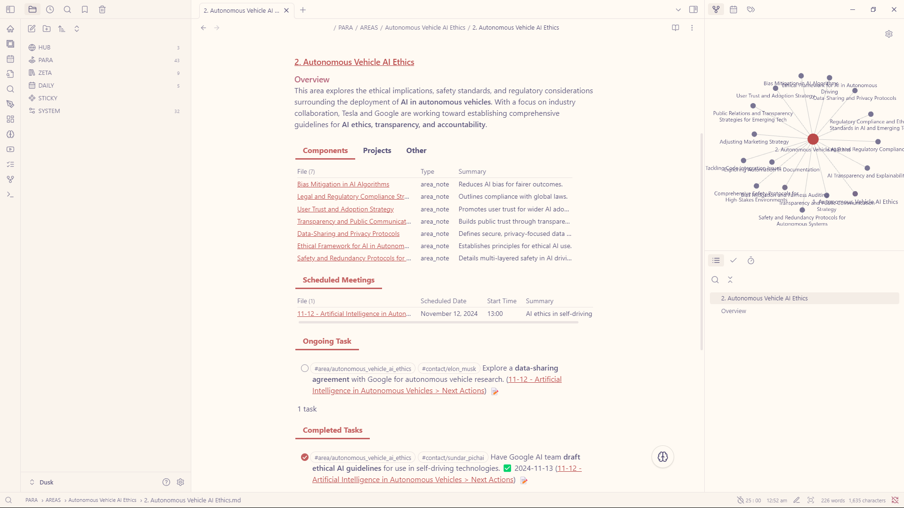
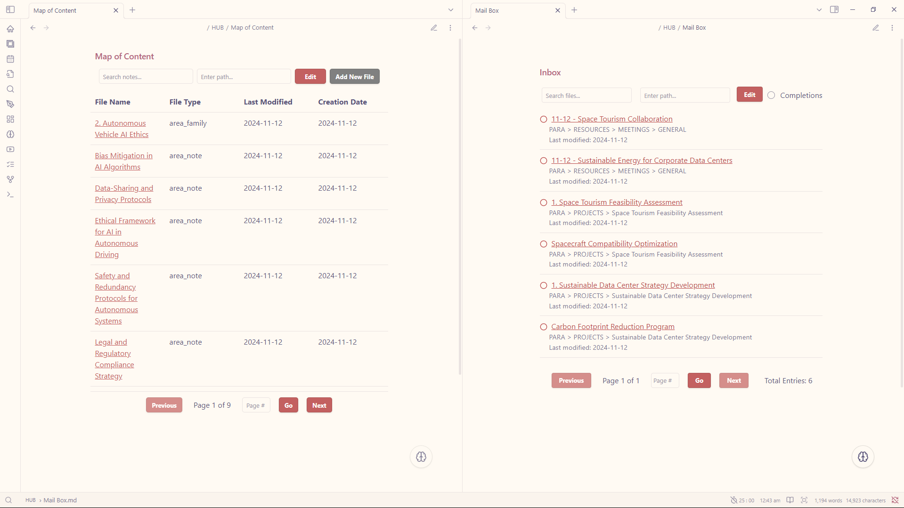

## Working on it **(up in about 2 days)**
- [ ] light version of the vault (only include plugins used for the core functionalities)
- [ ] mobile display compatibility
- [ ] better documentation

## Vault Structure
This vault fuses **PARA** and **Zettelkasten** frameworks for a dynamic, scalable knowledge system.
- **HUB**: Central command with a homepage, map, and inbox for seamless navigation and task tracking.
- **PARA**: Action-focused—**Projects** for deadlines, **Areas** for ongoing pursuits, **Resources** for all reference materials, and **Archive** for completed work.
- **ZETA**: Idea-centric—**Permanent Notes** for lasting insights, **Literature** for research, and **Fleeting Notes** for quick ideas.
- **DAILY**: Organized reflections on a daily, weekly, or monthly basis.
- **STICKY**: Temporary notes for brainstorming.
- **SYSTEM**: Core vault setup, housing media, templates, and configurations.

Built for growth, this structure adapts as your knowledge and projects evolve!
## Vault Features
- [x] **Homepage** - Enhanced homepage that allows quick navigation across the vault.
- [x] **Map of Content** - Easily search notes with the help of Datacore.
- [x] **Mail Box** - View completed and existing "Page Task" with the help of Datacore.
- [x] **Page Task** - Mark note files as a task (this is different from the task inside a note).
- [x] **Floating Action Button** -  A FAB to assist you so you can focus more on taking down notes.
- [x] **Connections and Quick Navigation** - Access anything anywhere.
- [x] **Focus Mode** - Focus mode macro command and pomodoro integration
- [x] **QuickAdd** - Templates and Macro commands available
- [x] **Hotkeys** - Convenient hotkey binding for common functionality.
## Additional Notes
- Highly detailed vault documentation can be found inside the vault.
- two `.zip` files are available, one contains a **populated vault** and the other one is an **empty vault** ready for use.
- Concept Inspiration and Reference can be found inside the vault.
## Feedback and Requests
I appreciate any feedback you have! If you have requests, feel free to open an issue on GitHub or reach out to me directly on Discord (@dusk2681).

---

Love this vault setup? You can support my work by grabbing me a [coffee](https://buymeacoffee.com/dusk_was_here). Thank you! ☕️

## Demo

## Screenshots

